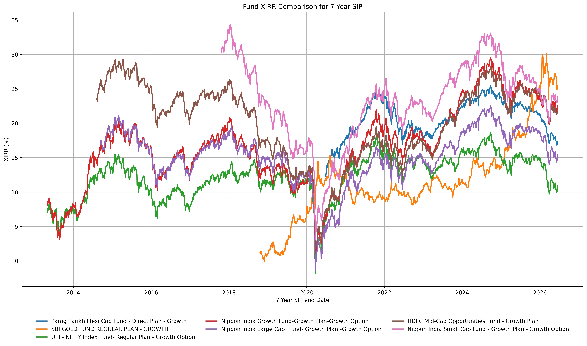
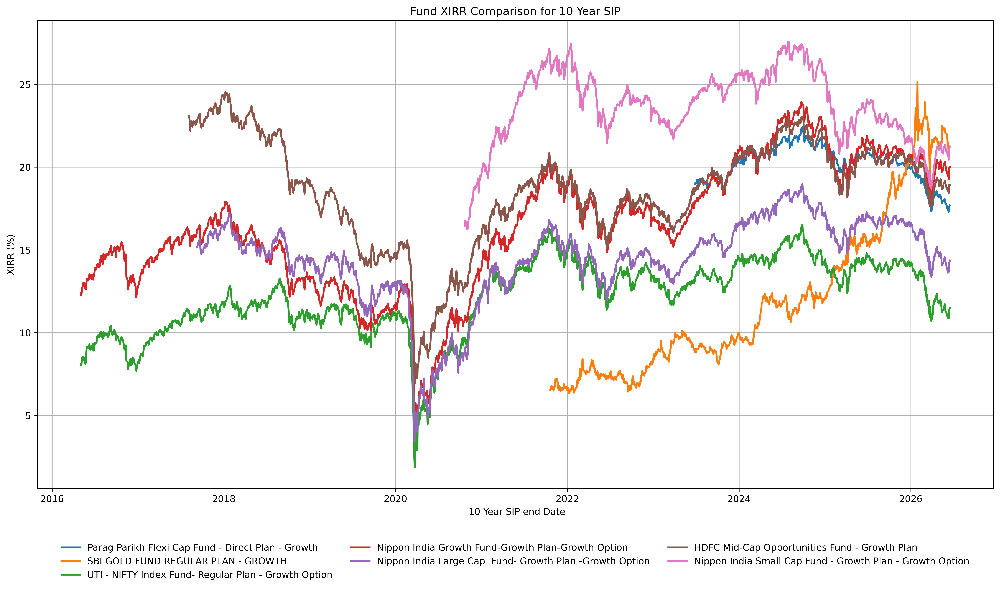

# Graphing Mutual Fund Returns and Risks

Have you ever wondered how SIP returns in different Mutual funds would vary over time?
I have been reading posts on https://www.reddit.com/r/MutualfundsIndia/ where people invest quite substantially in Small and Mid Cap funds, looking at their high returns.
It is said that these funds are riskier than Large Cap funds, but I didn't really understand how. Hence I though I will look at SIP returns, and try to measure their risk in some way

## Assumptions
 - I though of analyzing funds from different equity classes, and see their long term returns. Even though all of my funds are Direct funds, I couldn't use them for analysis, because most of the Direct funds are only from 2013 onwards. The 'regular' avatar of those funds have a longer history, and hence I decided to analyze them instead. 
 - I decided to consider the following funds in my analysis:
  1. Parag Parikh Flexi Cap Fund
 2. UTI - NIFTY Index Fund
 3. Nippon India Growth Fund
 4. Nippon India Large Cap Fund
 5. HDFC Mid-Cap Opportunities Fund
 6. Nippon India Small Cap Fund
 7. SBI GOLD FUND REGULAR PLAN

The only criteria for selection was to have funds which have a long history, and large AUM, and compare them against a much favoured fund (PPFCF). I also added a Gold fund to the Mix, because many people are investing in gold due to the recent increase in prices of Gold.

Incase you want to consider some other funds, you can use the scheme codes from here: https://portal.amfiindia.com/spages/NAVAll.txt

- For each fund, and I ran a simulated monthly SIP of ₹5000, for every  available period from 2005 to 2026, and let the SIP run for 7 years and 10 years.
- Along with the returns, I also calculated the XIRR as well as the Maximum Draw Down.
- To consider risk, I calculated when the fund fell the most from month to month, and recorded the maximum fall (in percentage) in each of the simulated SIP (Most of these clustered around 2008, 2016 & 2020)
- I consider this as a good metric for risk, because if your portfolio value in a  fund falls by 25% in a month, you may loose confidence and stop the next SIP.

## Process

 1. Run the [getdata.py](getdata.py) file to download the historic navs for your selected list of funds. These would get saved in the `mf_data` directory. 
 2. Additionally this would also run the simulated SIPs for every 7 and 10 year available period  from 2005 onwards.
 3. Once that data is available, you can run the other python files to generate the graphs

## Output of Analysis

The Graph of 7 years SIPs:

---

The Graph of 10 years SIPs:

---

Looking at these graphs, one might be tempted to invest only in the small and mid cap funds, because they seem to be always giving higher return, when compared to Large Cap funds, and NIfty 50 Index Funds (leaving aside the hige rise in Gold in the last couple of years)

But consider the following:

 1. The Small Cap especially, and the Mid Caps are very cyclcical. You see the lines fall much more than the other funds.

 2. The Fall in these funds is much higher (as a percentage) than compared to the higher funds.

 This second point is more apparent when you graph the Max DrawDowns.

 

 From this graph it is quite clear that Small Cap SIPs have had drawdowns of around 28% while Largecap index fund has had drawdowns of only 20%, while the popular PPFCF has had drawdown of only 20%.